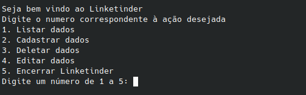

Seja Bem Vindo!!!

No momento ela está na versão 1.3.0. E nesta versão ela foi desenvolvida usando Groovy somente.

Para execução da aplicação, será necessário, ter instalado:
    - Java 8 ou superior:
    - Postgresql 11 ou superior:

Com os itens acima instalado, basta baixar o arquivo app.jar, ir até a pasta onde foi realizado o download abrir o terminal naquela pasta, e executar o comando:

java -jar app.jar

Com isso a aplicação irá iniciar no seu terminal, conforme imagem abaixo:

De acordo com o número escolhido a ação será executada.

Se trata de uma aplicação de terminal, cujo objetivo é, usando a funcionalidade de Match do Tinder, com o campo individual de competências do Linkedin estabelecer uma relação entre empresa recrutadora e candidato.

Neste momento, existem 2 versões da aplicação:

BackEnd: Está aplicação funciona no terminal foi desenvolvida com Groovy. A persistencia evoluiu e agora é realizada com postgresql mais abaixo irei descrever como funciona, as entradas de terminal estão todas verificadas com Regex. Os testes da aplicação foram desenvolvidos em JUnit 4.

Resumindo a lógica do Back:
    - Tenho uma classe Usuarios, que foi criada para ser herdada pelo Candidato e pela Empresa, pois as mesmas possuem caracteristicas de usuário.
    - Para realizar as validações de entrada no terminal a aplicação conta com uma classe chamada regexUsuários, que valida todas entradas de terminal.
    - Após realizar a modelagem do banco, foi necessário alterar a lógica e a estrutura do projeto, anteriormente existia classes para arrays que recebia individualmente candidato e empresa para adicionar os objetos e até mesmo apresentá-los estes foram descartados pois não eram mais necessários.
    - Separamos as competencias dos usuários, agora existe uma classe para tratar estes objetos e possuimos uma tabela única para armazená-los, o mesmo acontece para as vagas e paises.
    - As competencias podem ser adicionadas aos candidatos e as vagas, uma tabela de transição foi criada para não gerar dados duplicados nas tabelas de candidatos ou vagas. Assim ao registrar as competencias, junto ao id_competencia é registrado o id da vaga ou candidato nesta tabela de transição.
    - Na persistencia dos candidatos e empresas é realizado um registro de id_Pais na tabela, pois os países foram salvos em outra tabela para respeitar as normas da modelagem.

FrontEnd: É uma aplicação desenvolvida majoritariamente em TypeScript, onde os arquivos TS foram compilados usando o WebPack, na pasta de Front, é possível rodar a aplicaçao a partir da pasta "dist", e se necessário analisar a logica utilizada no TypeScript os arquivos estão na pasta src.

Lógica da aplicação Front:
- Assim como no back, foi utilizada uma classe usuarios para ser herdada pelo candidato e pela empresa, uma classe foi definida para as vagas.
- A partir dos objetos acima, criamos duas paginas para cadastro de empresas e candidatos, estás paginas vão salvar esses usuários ao LocalStorage para serem usados nas telas de perfil.
- A tela de cadastro é apresentada, porém só é possivel salvar uma vaga se existir alguma empresa cadastrada, como não possuimos uma pagina de login ainda, uma vaga só é adicionada se o cnpj da empresa digitado na tela de cadastro, for corresponde à alguma empresa cadastrada no LocalStorage.
- Para os candidatos por enquanto é apresentado apenas as vagas disponíveis, sem o cnpj da empresa, para preservar o anonimato.
- Para a empresa é apresentado os candidatos, o foco da apresentação é a descrição que o candidato fez, as competencias dele o cep e o Estado. Como diferencial foi desenvolvido um gráfico usando o canvas, onde mostra a quantidade de usuários X competencias.
    
Banco de dados:

 - Abaixo apresento o Diagrama Entidade Relacionamento

A representação gráfica acima foi desenvolvida usando o BRModelo. Para desenvolver o banco de dados, utilizei como base o site [dbdiagram](https://dbdiagram.io), nele desenvolvi o esqueleto do meu banco de dados, exportei o arquivo SQL pelo site realizei algumas edições no arquivo antes de rodá-lo no banco.
Dentro da pasta banco de dados se encontra o codigo sql, que gerou o banco e alguns dados de exemplo que foram inseridos.

Está aplicação será desenvolvida ao longo do programa Acelera ZG!!!
